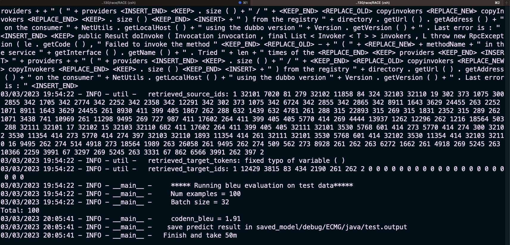

# Adjusted RACE Framework
## CSCI 4130 Group 3
This framework is based on: https://github.com/DeepSoftwareAnalytics/RACE
### Author:
- Peiyi Jiang (PJ@dal.ca)
- Haoyi Zhang
- Jiahao Chen

## Changes
1. Add conditions to determine if computer support cuda in the ECMG model. This will enable 
the model to be tested on a machine that doesn't have NVIDIA GPU
2. Decrease the batch number to solve the out of memory error on the Machines 
with inadequate GPU performance

## Instructions
> Downloading Dataset
> ```
> wget https://zenodo.org/record/7196966/files/dataset.tar.gz
>tar zxvf dataset.tar.gz
> ```
> dataset folder must be at the same level as the run script
1. Running on ARM64 MAC machine
```
# Create virtual env and activate
conda create --name py38 python=3.8
conda activate py38

# Install Rust compiler if you don't have it
curl --proto '=https' --tlsv1.2 -sSf https://sh.rustup.rs | sh

# Install packages
pip install -r requirements.txt

# Training
language=java
bash run.sh $language
```
Run small result:


2. Running on colab free tire

```
# Open GPU in the Runtime

# Upload dataset to your google drivee

# Refer the steps in run_colab.ipynb and examples in 
examples/run_colab.ipynb
```